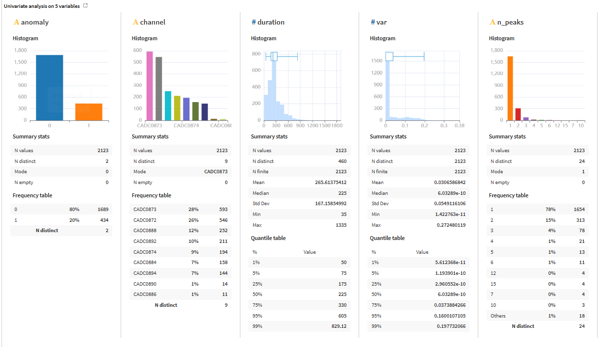
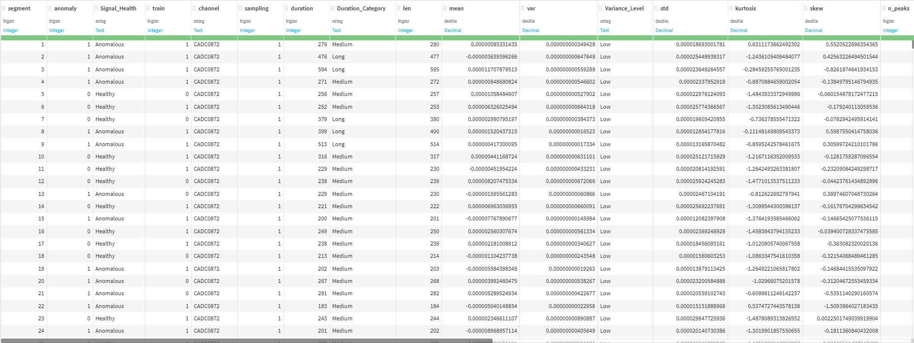

# 🛰️ ESA OPS-SAT Mission Control Telemetry Dashboard

An end-to-end Data Analytics project built using **Dataiku DSS**, **Power BI**, and **DAX** to monitor satellite telemetry, detect anomalous patterns, and support engineering decision-making using real **ESA OPS-SAT** mission telemetry data.

---

# 📖 Overview

This project analyzes real telemetry data collected from the **European Space Agency (ESA) OPS-SAT** mission to monitor spacecraft health, detect anomalous telemetry behaviour, and support predictive maintenance.

The project follows a complete analytics workflow, combining **Dataiku DSS** for data preparation, statistical analysis and feature engineering with **Power BI** for interactive dashboards and operational decision support.

The objective is to transform raw satellite telemetry into meaningful operational insights that help Mission Control engineers monitor spacecraft performance and identify abnormal behaviours before they become critical issues.

---

# ⭐ Project Highlights

- 📡 Analysis of **2,123 telemetry segments**
- 🚨 **20.4%** of telemetry classified as anomalous
- 📊 Interactive Mission Control dashboard built in **Power BI**
- ⚙️ Feature engineering performed in **Dataiku DSS**
- 📈 Engineering-oriented KPIs for spacecraft health monitoring
- 🔍 Statistical analysis supporting anomaly investigation
- 🛰️ Business storytelling inspired by real Mission Control operations

---

# 🎯 Business Objectives

- Monitor spacecraft telemetry health
- Detect anomalous telemetry signals
- Identify engineering priority events
- Analyze subsystem behaviour
- Support predictive maintenance
- Deliver operational insights through interactive dashboards

---

# 📂 Dataset

**Source**

European Space Agency (ESA)

OPS-SAT Telemetry & Anomaly Detection Dataset

**Dataset Size**

- 2,123 telemetry segments
- 9 telemetry channels
- Binary anomaly classification
- Statistical features extracted from real telemetry signals

Main variables include:

- Channel
- Duration
- Mean
- Variance
- Standard Deviation
- Kurtosis
- Skewness
- Number of Peaks
- Anomaly Label

---

# 🛠 Technologies

- Dataiku DSS
- Power BI
- DAX
- CSV
- GitHub

---

# ⚙️ Analytics Workflow

```text
ESA OPS-SAT Telemetry Dataset
            │
            ▼
      Dataiku DSS
──────────────────────────────
• Data Cleaning
• Statistical Analysis
• Feature Engineering
──────────────────────────────
            │
            ▼
        Power BI
──────────────────────────────
• KPI Design
• Interactive Dashboard
• Data Storytelling
──────────────────────────────
            │
            ▼
 Mission Control Insights
            │
            ▼
 Predictive Maintenance Support
```

---

# 🧹 Data Preparation

The dataset was prepared using **Dataiku DSS**.

Main preparation steps included:

- Data quality verification
- Feature engineering
- Business-friendly categorization
- Statistical exploration
- Dashboard-ready dataset generation

---

# 🧠 Feature Engineering

Several business-oriented variables were created to improve dashboard readability and support engineering decision-making.

Created Features

- Signal Health
- Engineering Priority
- Duration Category
- Peak Complexity
- Variance Level

These engineered features transform raw telemetry statistics into intuitive operational indicators for Mission Control teams.

---

# 📊 Exploratory Data Analysis

Statistical analysis was performed before dashboard development in order to understand telemetry behaviour.

The exploration focused on:

- Anomaly distribution
- Telemetry channel behaviour
- Signal duration
- Variance distribution
- Peak activity
- Statistical feature comparison

This exploratory phase guided the design of the final dashboard and KPI selection.

---

# 📈 Dashboard Features

## Executive Monitoring

- Total Telemetry Segments
- Healthy Signals
- Anomalous Signals
- High Priority Events
- Anomaly Rate

## Engineering Analysis

- Signal Health Distribution
- Engineering Priority Distribution
- Telemetry Events by Channel
- Average Telemetry Duration
- Peak Complexity by Channel

## Interactive Filtering

The dashboard allows filtering by:

- Telemetry Channel
- Signal Health
- Engineering Priority
- Duration Category

---

# 💡 Key Insights

- **20.4%** of telemetry signals were classified as anomalous.
- Healthy signals represented nearly **80%** of all observations.
- **CADC0872** generated the highest number of anomalous telemetry events.
- Anomalous telemetry lasted significantly longer than healthy telemetry.
- Nearly half of telemetry events were classified as **Low Engineering Priority**.
- Most telemetry signals exhibited **Simple Peak Complexity**, while complex signals remained relatively uncommon.

---

# 📋 Final Analysis

The dashboard provides a comprehensive overview of the operational health of the ESA OPS-SAT telemetry system.

## Executive Summary

A total of **2,123 telemetry segments** were analyzed across **9 telemetry channels**.

The analysis shows that **79.6%** of telemetry signals were classified as healthy, while **20.4%** were identified as anomalous. Although the satellite operates normally for the majority of observations, approximately one out of every five telemetry segments requires engineering attention.

---

## Spacecraft Health

The overall telemetry distribution indicates stable spacecraft behaviour with a relatively low anomaly rate.

Healthy telemetry dominates the dataset, suggesting that the OPS-SAT mission is operating under normal conditions for most observations.

However, the presence of more than **400 anomalous telemetry events** highlights the importance of continuous monitoring and early anomaly detection.

---

## Engineering Prioritization

Engineering Priority analysis reveals that:

- **48.6%** of events are classified as Low Priority
- **29.4%** are Medium Priority
- **22.0%** are High Priority

This distribution allows Mission Control teams to focus engineering resources on the most critical telemetry events while maintaining awareness of lower-risk signals.

---

## Channel Behaviour

Telemetry activity is not evenly distributed across channels.

The analysis identified **CADC0873** and **CADC0872** as the most active telemetry channels.

Among them, **CADC0872** generated the highest number of anomalous telemetry events, making it the primary candidate for engineering investigation and continuous monitoring.

This suggests that monitoring efforts should prioritize this channel when abnormal behaviour is detected.

---

## Signal Duration Analysis

The average duration of anomalous telemetry (**322 seconds**) is significantly higher than the average duration of healthy telemetry (**251 seconds**).

This observation suggests that abnormal telemetry events tend to persist longer than nominal operations.

Signal duration may therefore represent a useful predictive indicator for future anomaly detection models.

---

## Peak Complexity Analysis

Most telemetry signals were classified as **Simple Peak Complexity**.

Only a relatively small proportion of signals exhibited Moderate or Complex peak behaviour.

Since complex telemetry patterns occur less frequently, they may represent unusual spacecraft conditions deserving additional engineering analysis.

---

## Operational Value

The dashboard transforms complex telemetry statistics into intuitive engineering KPIs, enabling Mission Control teams to:

- Monitor spacecraft health in real time.
- Detect abnormal telemetry behaviour.
- Prioritize engineering investigations.
- Identify critical telemetry channels.
- Support predictive maintenance strategies.
- Improve operational decision-making through interactive analytics.

Overall, this project demonstrates how telemetry data can be converted into actionable engineering insights using modern Business Intelligence and Analytics tools.


---

# 📊 Dashboard Preview

## Executive Dashboard



---

## Engineering Dashboard


---

# 🔬 Dataiku Workflow



---

# 📈 Statistical Analysis


---

# 💼 Business Value

The dashboard enables Mission Control teams to:

- Monitor spacecraft operational health
- Detect abnormal telemetry behaviour
- Prioritize engineering investigations
- Support predictive maintenance
- Improve operational decision-making through interactive analytics

---

# 🎯 Skills Demonstrated

- Data Cleaning
- Feature Engineering
- Exploratory Data Analysis
- Statistical Analysis
- Data Visualization
- Dashboard Design
- Business Intelligence
- DAX
- KPI Design
- Business Storytelling
- Data Analytics

---

# 📂 Repository Structure

```text
ESA-OPS-SAT-Mission-Control-Telemetry-Dashboard
│
├── README.md
├── LICENSE
│
├── documentation/
│   └── ESA_OPS_SAT_Telemetry_Dashboard_Documentation.pdf
│
├── screenshots/
│   ├── executive-dashboard.png
│   ├── engineering-dashboard.png
│   ├── dataiku-workflow.png
│   └── statistical-analysis.png
│
├── powerbi/
│   └── Mission_Control_Telemetry_Dashboard.pbix
│
├── data/
│   ├── telemetry_dataset.csv
│   └── feature_description.md
│
└── assets/
```

---

# 🚀 Future Improvements

- Real-time telemetry streaming
- Time-series anomaly monitoring
- Predictive Machine Learning models
- Automated anomaly alerts
- Advanced drill-through dashboard pages

---

# 👤 Author

**Khouchou BEN AMARA**

**Data Analytics | Product Analytics | Business Intelligence**

Passionate about transforming complex telemetry and operational data into actionable business insights through analytics, visualization and data storytelling.

---

## ⭐ If you found this project interesting, feel free to leave a star on the repository!
